# RLChess


### Team members:
Borja García, Pol García, Sergi Parera, Sergi Sellés
### Advisor:
Daniel Fojo

### Framework:
Pytorch

## Project goals
### The algorithm Works
The algorithm is working and is able to play games. The result is irrelevant as long as the game is finished.
### The algorithm is not just random
The algorithm learns how to win games, achieving a positive and significant ratio win/loss against a random-movement player
### The algorithm aims to win
Explore how the algorithm performs against a 1000-ELO player. This score is the entry point for all players, which means the player knows the basic rules and strategies in chess.
### Doing the same with less
Optimize the algorithm in order to do the same as above but with less resources. This would be the last step in our journey. It is not really related to any of the goals above, but it would be our next step towards excellence.


## Environment setup
We didn’t want to start the simulation always from the initial board because we thought it would be slow to train full games so we wanted to feed the network with already initialized boards from a database to make it learn not only how to start a game but also how to end one.  
With the original environment it was not possible, so we created our custom environment using a modified Board Encoding function that we could understand. Then we just wrote the rest of the functions to move, print the board and the legal actions using python chess as a backend.


# Reinforcement learning algorithms

## Policy Gradient
### Hypothesis
### Experiment setup
### Results
### Conclusions (new hypothesis)

## DQN
### Hypothesis
### Experiment setup
### Results
### Conclusions (new hypothesis)


## Proximal Policy Optimization (PPO)
### Hypothesis
PPO is a more powerful RL algorithm. It is really similar to the A2C *Advantage Actor Critic* but with the diference that the gradients are clipped. It prevents too abrupt changes in the policy by limiting the gradients. [PPO paper](https://arxiv.org/abs/1707.06347v2)  

General algorithm explanation.
The algorithm consists of several steps.
1. Collect different trajectories of T timesteps (T can be lower than a full episode length)  
1. Calculate advantages  
    The advantages are calculated using the Generalized Advantage Estimation algorithm explained in: [GAE paper](https://arxiv.org/abs/1506.02438)
1. Save each: state, action taken, action log probabilities, predicted value, reward, 
1. Split the data collected in minibatches.
1. Calculate the losses.  
Here is where PPO is different from standard Policy Gradient or Actor Critic.
First, we save the collected log probabilities for the actions. Then we use the network to calculate new log probabilities for the same action.  
This is used to calculate a **ratio** between this log probabilities which measure how fast they changed.  
Then PPO will truncate this ratio to a value between  to . In the paper .  
Two surrogate values are calculated, One is the unclipped ratio multiplied by the advantages and the other is the clipped ratio multiplied by the advantages.  
The loss is going to be the negative of the minimum between these two surrogate values.  
The negative is because of the Policy Gradient Theorem. We introduce an entropy term to the loss to improve exploration.  
Value loss is just the MSE between the predicted values for each state and the accumulated discounted rewards.
1. Both losses are summed and then backpropagated.
This training loop across all the data is repeated more than once.
With this algorithm we were able to solve the Lunar Lander environment and be sure that we had a working algorithm and we can tackle the chess problem.

### OpenAI Gym experiments setup

In order to debug and be sure that the PPO we implemented worked we first tested it with some Open AI Gym Environments such as:  
* [Cart Pole](https://gym.openai.com/envs/CartPole-v1/)
* [Lunar Lander](https://gym.openai.com/envs/LunarLander-v2/)
* [Mountain Car](https://gym.openai.com/envs/MountainCar-v0/)  

For this experiments we used two separate networks. One for the policy and one for the value. Both had the same *core* structure but different top layers size to match the action space and the value size respectively.  
The input size of the network was the observation space size, with a hidden layer of size 256 and an output layer of size described above.

Some hyperparameters used were:


```
learning_rate = 1e-3
state_scale = 1.0
reward_scale = 1.0
clip = 0.2
n_epoch = 4
max_episodes = 10
max_timesteps = 100
batch_size = 32
max_iterations = 1000
gamma = 0.99
gae_lambda = 0.95
entropy_coefficient = 0.01
```
### Results
The results look promising. The algorithm runs perfectly and is sable to learn even more complex environments like Mountain Car.  
The difficulity with Mountain Car is that the reward is always the same until it learns to reach the top so it has to start exploring by itself moving right and left.
### CartPole
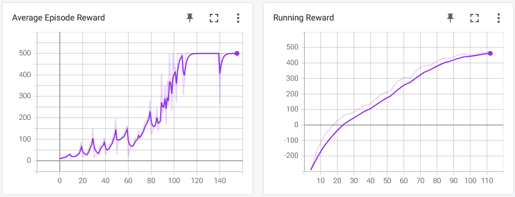
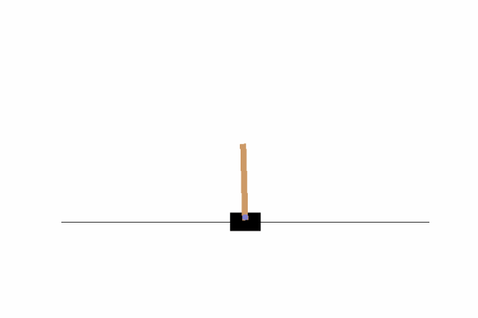

### Lunar Lander
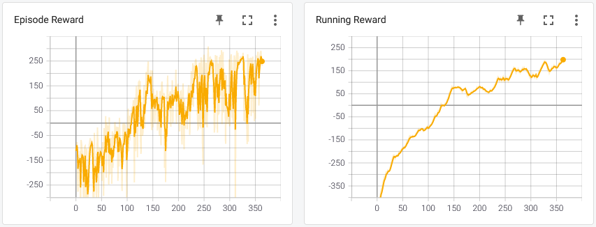  
Untrained Lunar Lander  
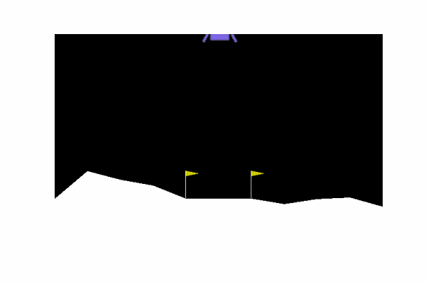  
Trained Lunar Lander  
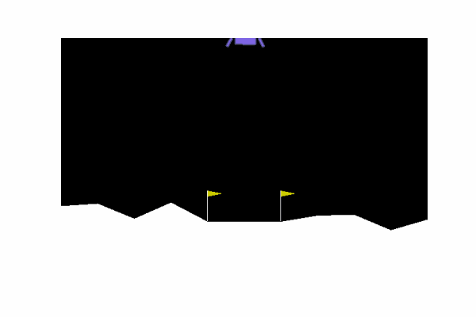

### Mountain Car
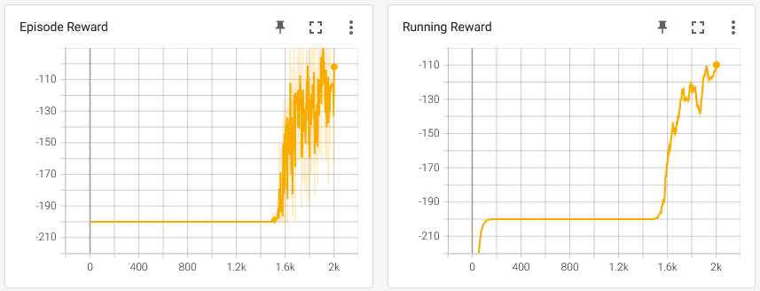  
Untrained Lunar Lander  
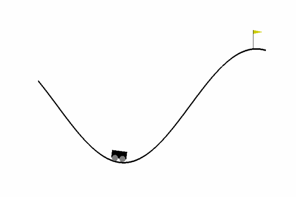   
Trained Lunar Lander  
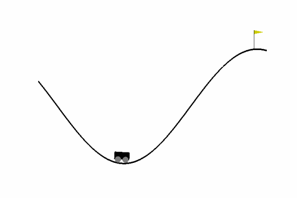 

### Chess enviroment setup

Learning chess is not like the others environments. The output of the network must have a constant dimension (the action space). But each evaluated state does not have the same number of legal moves so some actions are not pickable. This is when we apply a mask to mask out all illegal moves and we create a probability distribution only with the legal ones where to sample from.

### Reward system


### Results
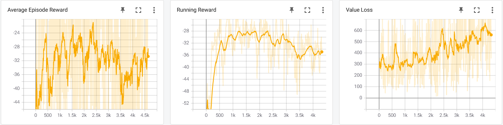  

### Conclusions
The algorithm is not able to learn how to play chess. even after a long training it does not improve.  
Possible causes:
- The network is not able to extract the necessary features
- Any kind of tree search algorithm should be implemented in order to select better actions.
- More time/computing power is required

## Supervised learning
### Hypothesis
The previous algorithms did not work as expected. One possibility is that the network architecture is not capable of learning how to play chess. So a good starting point could be to try to teach it using supervised learning. If it is able to learn it will be proof that the network is not the issue.

### Experiment setup
There are a lot of chess datasets online. We will use one from [Kaggle](https://www.kaggle.com/datasnaek/chess) and use supervised learning on the network.  
The dataset consists of games in pgn format. We used the python-chess library and our custom enviroment to create a datset with boards as inputs and movements as outputs.  
The network we will use is a Resnet 18 with the top FC layer set to match our action space.
### Results
Using this dataset we were able to teach the network how to predict a move from the current board state. It reached an accuracy of around **25%** and when tested against a random player it was able to beat it the majority of times.  

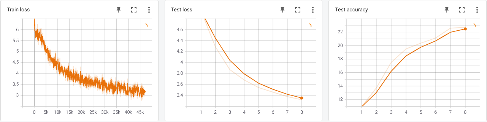  

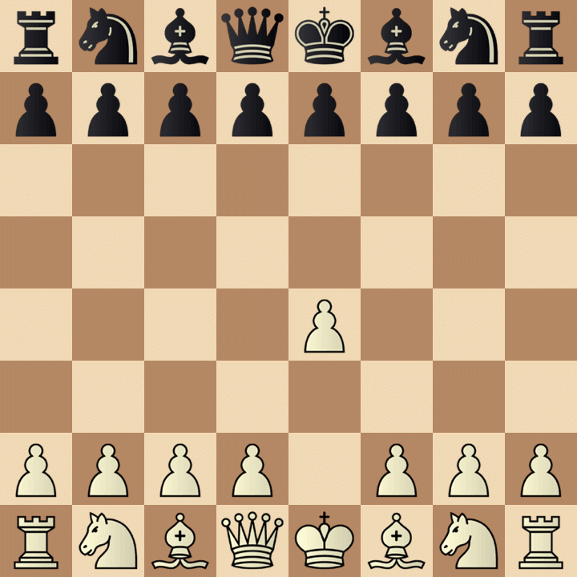


## Conclusions
### The algorithm Works
The algorithm is working and is able to play games.
### The algorithm is not just random
The algorithm learns how to win games when trained with supervised learning.
### The algorithm aims to win
When tested against a random player it wins but we have not been able to test it against a 1000 ELO player. We suspect it would not be able to win.
### Doing the same with less
We have not been able to improve the algorithm in order to consume les resources or be faster in inference time.


## Next steps


## References